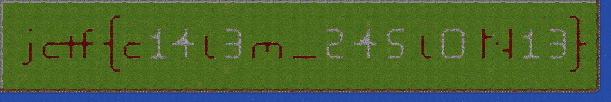

# fibula

`flag.mtbo` is a reversed `otbm` file, which is a format for OpenTibia maps. The flag is written using tiles at the 0,0 coordinates.


## Writeup

* Reverse `flag.mbto` byte by byte and create `flag.otbm`
* Open it using remeresmapeditor.com, ignore the errors about houses and spawns
* Navigate to (0,0,7)
* Decode the flag from the tiles

Beggining of `flag.otbm`:
```
OTBMþ�������������9���þ��"�All lowercase!!!!!!!!!!!!!!!!!!!!!���No map description available.���flag-spawn.xml��flag-house.xml
```

As you can see, the file starts with `OTBM` magic constant, which makes it trivial to find the real file format. Also the "All lowercase!!!" string not only makes it easier to discover the file has been reversed, but also describes the flag format.

Art looks like this:



Flag is `jctf{c14l3m_245l0n13}` .